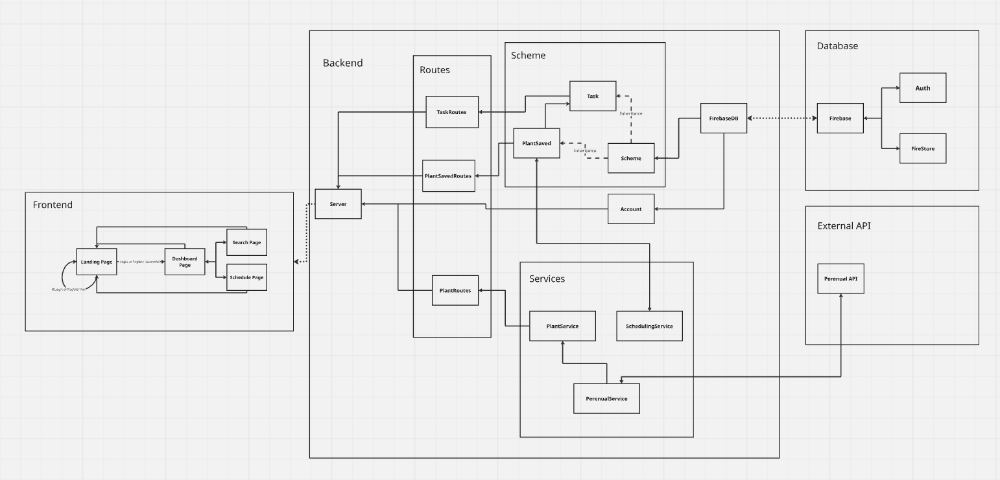

# Introducing Garden Buddy

## Project overview

*A full-stack gardening companion application built with React, Node.js, Express, and Firebase.*

Garden Buddy helps users discover plants, build a personalised digital garden, and automatically generate plant care schedules. Users can search thousands of plants using the Perenual API, save favourites to their garden, and keep track of care tasks.


## Key features

- User registration and login using Firebase Authentication
- Secure protected routes
- Search for plants and view detailed plant information using the Perenual API
- Save plants to a personal digital garden
- Automatically generate care schedules based on plant type
- Track and complete plant care tasks
- Dashboard showing saved plants and garden overview
- Responsive React frontend


## Design

### Initial wireframe

The initial wireframe was created during the planning phase, to visualise the application's four main pages and overall User journey.


## Colour Palette
- 🟩 Forest Green `#3E5C34`
- 🌿 Sage Green `#8BAE78`
- 🟨 Sand Beige `#C9B99A`
- 🤍 Cream White `#FDF6EC`


## Tech stack

### Frontend

- React
- React Router
- Redux Toolkit
- Bootstrap

### Backend

- Node.js
- Express

### Database & Authentication

- Firebase Authentication
- Cloud Firestore

### External API

- Perenual Plant API


## Project structure

```
.
├── Backend
│   ├── Auth
│   ├── Database
│   ├── Routes
│   ├── Scheme
│   ├── Services
│   ├── Tests
│   ├── server.js
│   └── package.json
├── docs
├── Frontend
│   ├── public
│   ├── src
│   │   ├── api
│   │   ├── assets
│   │   ├── components
│   │   ├── data
│   │   ├── feature
│   │   ├── pages
│   │   └── styles
│   ├── package.json
│   └── vite.config.js
├── package.json
└── README.md
```

The project is organised into separate frontend and backend folders. The `Frontend` contains the React user interface, reusable components, and API helper functions. The `Backend` contains the Express server, routes, business services, Firebase integration, and data models. The `docs` folder contains the project's planning, research, and technical documentation.

## Architecture

Garden Buddy uses a React frontend, a Node.js and Express backend, Firebase services, and the external Perenual API. The React frontend provides the user interface (including plant search, and plant/task management) and sends HTTP requests to the backend. The backend manages application logic, including plant management, API requests, and scheduling functionality. Plant data is retrieved from the Perenual API and passed through the backend before being displayed in the frontend. Firebase Authentication manages user accounts and login, while application data (including saved plants and generated care tasks) is stored in Cloud Firestore. The Scheduling Service generates plant care schedules/tasks using predefined care templates based on plant type.




## Installation and Setup

### 1. Clone the repository

`git clone https://github.com/RKaurB/cfgdegree-fullstack-project-group3.git`

`cd cfgdegree-fullstack-project-group3`

### 2. Install dependencies

#### Backend

From `/Backend`:
```
npm install
```

#### Frontend

From `/Frontend`:
```
npm install
```

### 3. Configure Firebase

Create a Firebase project and enable:

- Email/Password Authentication
- Cloud Firestore

### 4. Generate a Perenual API key

Register and generate a Perenual API key from:

https://perenual.com/docs/api


### 5. Create a `.env` file

Create a `.env` file containing the required environment variables.

#### Example (see `.env.example`)

```
# Perenual API key
PERENUAL_API_KEY=your_perenual_api_key

# Firebase API key
FIREBASE_APIKEY=your_firebase_api_key
# Firebase configuration values (obtain from Firebase Console)
FIREBASE_APPID=your_firebase_app_id
FIREBASE_MeasurementID=your_firebase_measurement_id

# LOCAL BACKEND PORT
BACKEND_PORT=3000
```

### 6. Run the application

#### Start the backend:

From `/Backend`:
```
npm start
```

#### Start the frontend

From `/Frontend`:
```
npm run dev
```
#### Run the Backend Jest Test
From `/Backend`
```
npm test
```

The application should now be available in your browser.


## API endpoints

### Authentication

| **Method**   | **Endpoint**                       | **Purpose**                               |
|--------------|------------------------------------|-------------------------------------------|
| POST         | `/register`                        | Register new User account                 |
| POST         | `/login`                           | Login                                     |
| POST         | `/signout`                         | Logout                                    |

### Plants

| **Method**   | **Endpoint**                       | **Purpose**                               |
|--------------|------------------------------------|-------------------------------------------|
| GET          | `/api/plants/search?q={name}`      | Search for plants                         |
| GET          | `/api/plants/{id}`                 | Get plant details                         |

### Saved Plants

| **Method**   | **Endpoint**                       | **Purpose**                               |
|--------------|------------------------------------|-------------------------------------------|
| POST         | `/garden/AddNewPlant`              | Save plant and generate tasks             |
| GET          | `/garden/GetAllSavedPlantList`     | Get all saved plants                      |
| GET          | `/garden/GetSavedPlant/{id}`       | Get a single saved plant                  |
| DELETE       | `/garden/RemovePlantFromList/{id}` | Delete a saved plant and its linked tasks |

### Tasks

| **Method**   | **Endpoint**                       | **Purpose**                               |
|--------------|------------------------------------|-------------------------------------------|
| GET          | `/tasks/GetAllTaskList`            | Get care tasks                            |
| PUT          | `/tasks/UpdateTaskCompletion/{id}` | Mark task complete                       |


## Potential future improvements

- Recurring task generation after completion
- Push/email reminders
- Improved dashboard analytics
- Nature/gardening-related quotes (random) displayed on Dashboard
- Weather API integration


## Team

This project was completed as part of the [Code First Girls](https://codefirstgirls.com/) Full-stack Development CFGdegree.

Our team consisted of:

- [Destiny](https://github.com/Destinyoko1)
- [Hayley](https://github.com/hreed129)
- [Iman](https://github.com/Iman-Jama1)
- [Julia](https://github.com/juliavolponi)
- [Ozioma](https://github.com/Omanoma)
- [Rachel](https://github.com/RKaurB)
- [Siti](https://github.com/Ctdahlya2019)
