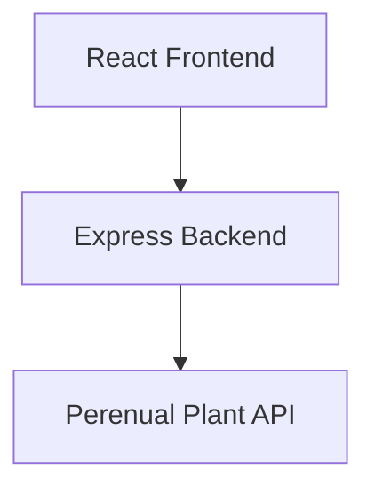
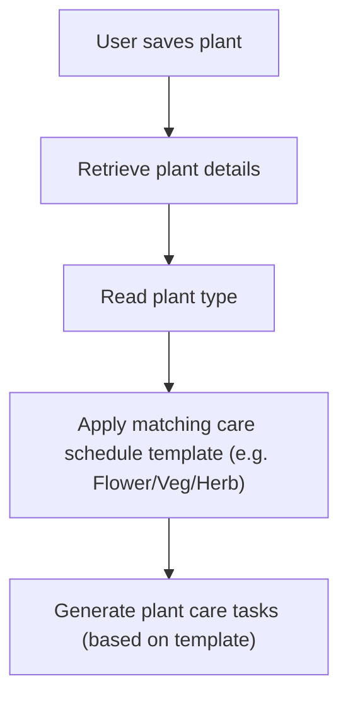
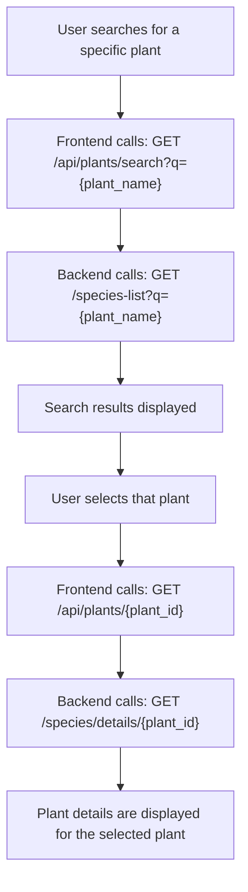

# Perenual API Research Notes

The Perenual API appears to be the most suitable API to provide plant information for the Garden Buddy app.

For the MVP, we need:

- Plant search
- Plant details (including plant type/category info)
- Plant images

The API should support the following user journey:


The Perenual API provides endpoints for:

- Searching plants (GET /v2/species-list)
- Retrieving detailed information about a specific plant (GET /v2/species/details/{id})

We will use:

- **Search endpoint** for Search page and Search results
- **Plant Details endpoint** for the Plant details page
- **Species Care Guide endpoint** for potential stretch goal after MVP (not currently required, as we plan to generate our own care schedule templates)

## API Setup

Perenual API requires an API key. 

### Documentation

https://perenual.com/docs/api 

### Generate an API key

Log in and click on ‘Get API Key & Access’

#### Example use

GET `https://perenual.com/api/v2/species-list?key={API_KEY}`

### Note

- Don’t share the API key in GitHub
- Store API key in backend .env file
- Frontend should not access the API key directly
- All Perenual requests should be made through our Express backend

### Application architecture



## Endpoint 1: Plant Search

Allows users to search for plants

### Format

GET `https://perenual.com/api/v2/species-list?key={API_KEY}&q={PLANT_NAME}`

### Example request

GET `https://perenual.com/api/v2/species-list?key={API_KEY}&q=carrot`

### Tested plant search terms

| Search term          | Result           | Example id        |
|----------------------|------------------|-------------------|
| basil	               | Success          | 5498              |
| cilantro             | Success          | 2098              |
| tarragon             | Success          | 974               |
| dill                 | Success          | 834               |
| celery               | Success          | 862               |
| fennel               | Success          | 2979              |
| rosemary             | Success          | 7109              |
| calamint             | Success          | 1464              |
| carrot               | Success          | 2320              |
| tomato               | Success          | 5021              | 
| turnip               | Success          | 1333              |
| kale                 | Success          | 1320              |
| beetroot             | No results       |                   |
| beet                 | Success          | 1273              |
| courgette            | No results       |                   |
| zucchini             | Success          | 2255              |
| brussel sprouts      | Success          | 1325              |
| broccoli             | Success          | 1327              |
| asparagus            | Success          | 1026/1027/1029    |
| chives               | Success          | 669               |
| pineapple            | Success          | 791               |
| strawberry           | Success          | 3013              |
| apple                | Success          | 362/363/365       |
| dahlia               | Success          | 2300              |
| daisy                | Success          | 1227              |
| carnation            | Success          | 2380              |
| daffodil             | Success          | 5325              |
| foxglove             | Success          | 2483/2493         |
| qwerty123            | No results       |                   |


### Example empty response

```
{
    "data": [],
    "total": 0
}
```


### Example response

```
{
"id": 123,
"common_name": "Plant Name, e.g. carrot",
"scientific_name": "Scientific Name",
"other_name": [],
"default_image": {
    "original_url": "..."
    }
}
```

### MVP fields

- `id` (unique plant identifier)
- `common_name` (display plant name)
- `scientific_name` (optional, scientific name)
- `other_name` (optional, alternative names)
- `default_image` (plant image)


### Search behaviour and data quality notes

#### Duplicate common names

Some search results return multiple plants sharing the same common name.

**Example search term:** `"carnation"`

- Multiple results returned with the same common name
- Scientific names differed between results
- Some records contained additional fields not present in others
- e.g. Some duplicate records contained a `type` field while others did not
- We may need to display scientific names alongside common names, to help users distinguish between similar plants.

#### Regional naming differences

Testing identified differences between UK and US plant names. 

The API appears to favour US naming conventions.

**Example search results:**

| UK                          | US                          |
|-----------------------------|-----------------------------|
| `beetroot` no results       | `beet` results returned     |
| `courgette` no results      | `zucchini` results returned |

**Potential future enhancement:** We could map common UK plant names to recognised API search terms.

#### Alternative name(s) field

The `other_name` field is not consistently available.

- Some plants contain alternative names
- Alternative names appear to represent regional or common naming variations
- Many tested plants do not include this field

#### Search matching behaviour

The API search behaviour is broader than a simple `common_name` lookup.

- Results may be matched using `scientific_name` or `other_name`
- Some returned results do not appear to contain the search term in the `common_name`

#### Category (`type`) inconsistencies

There are some inconsistencies between `type` values.

**Examples:**

- Herb
- Herbs
- Bulb (where plant is also a herb)

Note that `type` is a string, so cannot store more than one category value (e.g. if a plant could be categorised as more than one type).

We may need to try and map these values into simplified internal categories - such as Herb, Vegetable, Flower, Fruit - to help support scheduling and task generation logic.

### Proposed Backend endpoint:

GET `/api/plants/search?q={plant}`


## Endpoint 2: Plant Details

Display detailed information about a selected plant.

This information will be used by the Search results and Plant details pages.

### Format

GET `https://perenual.com/api/v2/species/details/{id}?key={API_KEY}`

### Example request

GET `https://perenual.com/api/v2/species/details/2320?key={API_KEY}`

(where `2320` = Plant id returned from the Search endpoint)


### Example JSON response

```
{
"id": 2320,
"common_name": "Plant Name, e.g. carrot",
“scientific_name”: “Scientific Name”,
“type:”: “Vegetable”,
"cycle": "Annual",
"watering": "Average",
"watering_general_benchmark": {
    "value": "\"3-4\"",
    "unit": "days"
},
"sunlight": ["Full Sun"],
"default_image": {
    "original_url": "..."
    }
}
```

### Available fields (examples identified during testing)

- `id`
- `common_name`
- `scientific_name`
- `type` (“vegetable”)
- `origin` (country)
- `cycle` (e.g. annual)
- `propagation` (e.g. “Seed Propagation”, “Cutting”, etc)
- `watering` (e.g. “Average”)
- `watering_general_benchmark` (e.g. "3-4 days")
- `sunlight` (e.g. “full sun”)
- `pruning_month`
- `seeds` (true/false)
- `maintenance` (effort required or time/task frquency, e.g. “Low”)
- `care_guides` (e.g. "http://perenual.com/api/species-care-guide-list?species_id=2320&key={API_KEY}")
- `growth_rate` (e.g. “High”)
- `indoor` (true/false)
- `care_level` (how forgiving the plant is, e.g. “Medium”)
- `harvest_season`
- `description` (in long paragraph format)
- `default_image` (same as plant search fields)

### Potential MVP fields

- `common_name` (display name) ✅
- `scientific_name` (optional, nice secondary info) ✅
- `default_image` (plant image, essential for UI) ✅
- `type` (plant category, e.g. Vegetable - needed for care template) ✅
- `watering` (useful plant care info) ✅
- `sunlight` (growing requirements, useful plant care info) ✅
- `cycle` (plant lifecycle, not essential)
- `maintenance` or `care_level` (care difficulty, useful) ✅
- `indoor` (could filter for outdoor only, maybe simpler to leave out)
- `description` (plant information, adds value to Details page) ✅
- `care_guides` (link, optional/stretch goal?)

### TODO

- Should indoor-only plants be excluded from MVP (i.e. outdoor, garden plants only)?
- Which fields should appear on the Plant Details page?

### Proposed MVP UI usage

#### Search Results page

Display:

- Plant Name (`common_name`)
- Scientific Name (`scientific_name`)
- Plant Image (`default_image`)

#### Plant Details page

Display:

- Plant Name (`common_name`)
- Scientific Name (`scientific_name`)
- Plant Image (`default_image`)
- Plant Type (`type`)
- Watering (`watering`)
- Sunlight (`sunlight`)
- Care Difficulty (`maintenance` or `care_level`)
- Description (`description`)

### Tested plant IDs

| ID        | Plant name      | Results/data notes                                       |
|-----------|-----------------|----------------------------------------------------------|
| 5498 	    | basil           | Returns: `SyntaxError: Unexpected token 'P',`            |
|           |                 | `"Please Upg"... is not valid JSON`                      |
|           |                 | `at JSON.parse (<anonymous>)`                            |
| 2098      | cilantro        | Herb, no `care_level`                                    |
| 974       | tarragon        | Herb                                                     |
| 834       | dill            | Herb, no `other_name`, no `care_level`                   |
| 862       | celery          | Herb, no `other_name`                                    |
| 2979      | fennel          | Herb, no `other_name`                                    |
| 7109      | rosemary        | Returns: `SyntaxError: Unexpected token 'P',`            |
|           |                 | `"Please Upg"... is not valid JSON`                      |
|           |                 | `at JSON.parse (<anonymous>)`                            |
| 1464      | calamint        | Herbs, no `other_name`                                   |
| 2320      | carrot          | Vegetable, no `other_name`                               |
| 5021      | tomato          | Returns: `SyntaxError: Unexpected token 'P',` (as above) | 
| 1333      | turnip          | Vegetable, no `other_name`                               |
| 1320      | kale            | Vegetable, no `other_name`                               | 
| 1273      | beet            | Vegetable, no `other_name`                               |
| 2255      | zucchini        | Fruit, matches with `other_name` only                    |
| 1325      | brussel sprouts | Vegetable, no `other_name`                               |
| 1327      | broccoli        | Vegetable, no `other_name`                               |
| 1026      | asparagus       | `type` null, 1027 duplicate is Vegetable, no `other_name`|
| 669       | chives          | Bulb (but is also a herb), no `other_name`               |
| 791       | pineapple       | Fruit, no `other_name`                                   |
| 3013      | strawberry      | Returns: `SyntaxError: Unexpected token 'P',` (as above) |
| 362       | Gala apple      | tree, various apple types e.g 363/365, no `other_name`,  |
|           |                 | no `maintenance` or `care_level`                         |
| 2300      | dahlia          | Flower, no `other_name`                                  |
| 1227      | English daisy   | Flower                                                   |
| 2380      | carnation       | Flower, no `other_name` or `care_level`                  |
| 5325      | daffodil        | Returns: `SyntaxError: Unexpected token 'P',` (as above) |
| 2483      | foxglove        | Herb (incorrect, should be Flower), no `other_name`,     |
|           |                 | `default_image` null                                     |
| 2493      | common foxglove | `type` null, no `other_name`, `care_level` null,         |
|           |                 | `default_image` null                                     |


### Proposed Backend endpoint:

GET `/api/plants/{id}`

(Frontend requests plant details → Backend retrieves data from Perenual API → Backend returns simplified plant details)


### Connection to Plant Care Scheduling

The Plant Details endpoint provides a type field.

#### Example

```
{
    ...
    “type:”: “Vegetable”,
    ...
}
```

This could be used by the Scheduling feature.

#### Proposed workflow



#### Note

The API appears to provide broad watering categories such as ‘Average’, as well as a watering_general_benchmark field, e.g.

```
"watering_general_benchmark": {
    "value": "\"3-4\"",
    "unit": "days"
}
```
For MVP it will be simpler to create predefined plant care templates rather than generating schedules directly from the API data.

However, the `watering_general_benchmark` field could be potentially useful as a stretch goal, to generate more accurate, plant-specific watering schedules.


## Optional Endpoint 3: Species Care Guide

Provides detailed (pruning, watering, and sunlight) care instructions for a selected plant, in long paragraph format.

Potential stretch goal - not required for MVP.


Info available:

- Watering guidance
- Sunlight guidance
- Pruning guidance

These could be used in future for more detailed plant info and more accurate/improved plant care schedule generation – particularly watering and pruning guidance.

Example request:

GET `https://perenual.com/api/species-care-guide-list?key={API_KEY}&q={plant_type}`

(where plant_type e.g. Vegetable)

The endpoint also supports:

- q={plant_name} (for searching guides by name) - e.g. `https://perenual.com/api/species-care-guide-list?key={API_KEY}&q=carrot`
- type=watering,sunlight (to limit guide sections)
- page={page_number} (for pagination)

## Plant Discovery Flow



## Notes and Limitations

### API Rate Limits

- Free tier allows developer accounts to make 100 API requests per day. 
- The API contains thousands of plant species details.
- Search results may return plants with IDs >3000.
- The free-tier Plant Details endpoint is limited to IDs 1-3000, so this restricts the plants that we can get full details for.
- During testing, Plant Details requests succeed for tested IDs <=3000.
- Plant ID 3001 returned an "Upgrade plan" message instead of JSON (JSON parsing error).


- We could store saved plant data in the database, to avoid repeated requests for the same plant (e.g. when User clicks `Add Plant to Garden`, we save part of the plant information from Perenual into our own database vs asking Perenual for that info each time).
- TODO: How should we handle API rate limits during development and testing?

### Missing data and optional fields

Some fields are not consistently populated across all plants. The Frontend will need to handle missing values and display fallback values where necessary, e.g. 'Information unavailable'.

**Examples:**

- `other_name`
- `type`

### Pagination

Search results are paginated (e.g. `page={page_number}`)

We could ignore pagination for MVP and use the first page of results only.

## Conclusion

Overall, the Search and Plant Details endpoints provide all of the information needed to:

- Search plants
- View plant details
- Display plant images
- Categorise plants

The plant `type` field may also provide the connection between plant management and plant care scheduling, by enabling the app to select the appropriate (e.g. Flower/Veg/Herb) schedule template.

Testing identified some data quality and consistency considerations, including:

- Optional fields
- Duplicate common names
- Inconsistent category values
- Scientific name formatting differences
- Regional naming differences
- Free-tier Plant Details endpoint limitations

These findings need to be considered when designing the Garden Buddy Plant API, scheduling logic, and user experience.

### Recommended approach for MVP

- Use Perenual Search for plant discovery
- Use Perenual Plant Details for plant information
- Map Perenual categories into simplified Garden Buddy categories
- Use predefined care templates for scheduling
- Focus initially on plants with verified Plant Details endpoint results