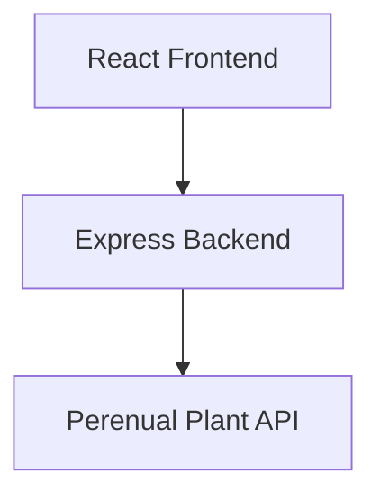
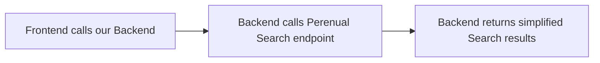
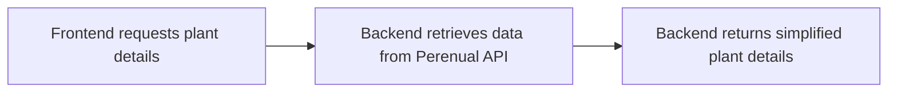
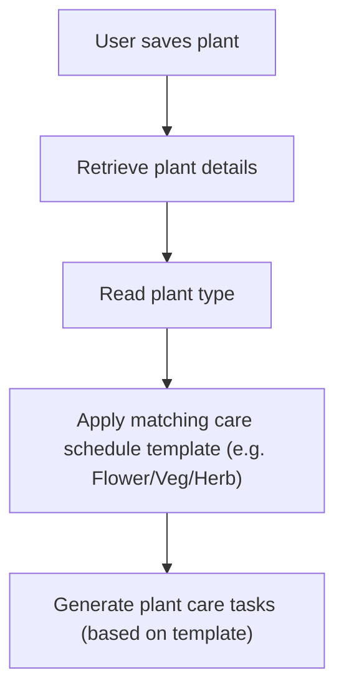
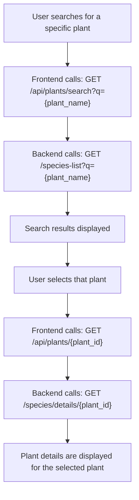

# Perenual API Research Notes

The Perenual API appears to be the most suitable API to provide plant information for the Garden Buddy app.

For the MVP, we need:

- Plant search
- Plant details (including plant type/category info)
- Plant images

The API should support the following user journey:


The Perenual API provides endpoints for:

- Searching plants (GET /v2/species-list)
- Retrieving detailed information about a specific plant (GET /v2/species/details/{id})

We will use:

- **Search endpoint** for Search page and Search results
- **Plant Details endpoint** for the Plant details page
- **Species Care Guide endpoint** for potential stretch goal after MVP (not currently required, as we plan to generate our own care schedule templates)

## API Setup

Perenual API requires an API key. 

### Documentation

https://perenual.com/docs/api 

### Generate an API key

Log in and click on ‘Get API Key & Access’

#### Example use

GET `https://perenual.com/api/v2/species-list?key={API_KEY}`

### Note

- Don’t share the API key in GitHub
- Store API in backend .env file
- Frontend should not access the API key directly
- All Perenual requests should be made through our Express backend

### Application architecture



## Endpoint 1: Plant Search

Allows users to search for plants

### Format

GET `https://perenual.com/api/v2/species-list?key={API_KEY}&q={PLANT_NAME}`

### Example request

GET `https://perenual.com/api/v2/species-list?key={API_KEY}&q=carrot`

### Tested plant search terms

| Search term          | Result                                       |
|----------------------|----------------------------------------------|
| basil	               | Success (id: 5498)                           |
| rosemary             | Success (id: 7109)                           |
| carrot               | Success (id: 2320)                           |
| tomato               | Success (id: 5021, or id: 2292 tree tomato)  | 
| dahlia               | Success (id: 2300)                           |
| qwerty123            | No results                                   |


### Example empty response

```
{
    "data": [],
    "total": 0
}
```


### Example response

```
{
"id": 123,
"common_name": "Plant Name, e.g. carrot",
"scientific_name": "Scientific Name",
"default_image": {
    "original_url": "..."
    }
}
```

### MVP fields

- `id` (unique plant identifier)
- `common_name` (display plant name)
- `scientific_name` (optional)
- `default_image` (plant image)

### Proposed Backend Endpoint:

GET `/api/plants/search?q={plant}`



## Endpoint 2: Plant Details

Display detailed information about a selected plant.

This information will be used by the Search results and Plant details pages.

### Format

GET `https://perenual.com/api/v2/species/details/{id}?key={API_KEY}`

### Example request

GET `https://perenual.com/api/v2/species/details/2320?key={API_KEY}`

(where `2320` = Plant id returned from the Search endpoint)


### Example JSON response

```
{
"id": 2320,
"common_name": "Plant Name, e.g. carrot",
“scientific_name”: “Scientific Name”,
“type:”: “Vegetable”,
"cycle": "Annual",
"watering": "Average",
"watering_general_benchmark": {
    "value": "\"3-4\"",
    "unit": "days"
}
"sunlight": ["Full Sun"],
"default_image": {
    "original_url": "..."
    }
}
```

### Available fields (examples identified during testing)

- `id`
- `common_name`
- `scientific_name`
- `type` (“vegetable”)
- `origin` (country)
- `cycle` (e.g. annual)
- `propagation` (e.g. “Seed Propagation”, “Cutting”, etc)
- `watering` (e.g. “Average”)
- `watering_general_benchmark` (e.g. "3-4 days")
- `sunlight` (e.g. “full sun”)
- `pruning_month`
- `seeds` (true/false)
- `maintenance` (e.g. “Low”)
- `care_guides` (e.g. "http://perenual.com/api/species-care-guide-list?species_id=2320&key={API_KEY}")
- `growth_rate` (e.g. “High”)
- `indoor` (true/false)
- `care_level` (e.g. “Medium”)
- `harvest_season`
- `description` (in long paragraph format)
- `default_image` (same as plant search fields)

### Potential MVP fields

- `common_name` (display name) ✅
- `scientific_name` (optional, nice secondary info) ✅
- `default_image` (plant image, essential for UI) ✅
- `type` (plant category, e.g. Vegetable - needed for care template) ✅
- `watering` (useful plant care info) ✅
- `sunlight` (growing requirements, useful plant care info) ✅
- `cycle` (plant lifecycle, not essential)
- `maintenance` or care_level (care difficulty, useful) ✅
- `indoor` (could filter for outdoor only, maybe simpler to leave out)
- `description` (plant information, adds value to Details page) ✅
- `care_guides` (link, optional/stretch goal?)

### TODO

- What is difference between maintenance and care_level fields? And which one is populated more consistently?
- Should indoor-only plants be excluded from MVP (i.e. outdoor, garden plants only)?
- Which fields should appear on the Plant Details page?

### Proposed MVP UI usage

#### Search Results page

Display:

- Plant Name (`common_name`)
- Scientific Name (`scientific_name`)
- Plant Image (`default_image`)

#### Plant Details page

Display:

- Plant Name (`common_name`)
- Scientific Name (`scientific_name`)
- Plant Image (`default_image`)
- Plant Type (`type`)
- Watering (`watering`)
- Sunlight (`sunlight`)
- Care Difficulty (`maintenance` or `care_level`)
- Description (`description`)

### Proposed Backend endpoint:

GET `/api/plants/{id}`

(Frontend requests plant details → Backend retrieves data from Perenual API → Backend returns simplified plant details)



### Connection to Plant Care Scheduling

The Plant Details endpoint provides a type field.

#### Example

```
{
    ...
    “type:”: “Vegetable”,
    ...
}
```

This could be used by the Scheduling feature.

#### Proposed workflow



#### Note

The API appears to provide broad watering categories such as ‘Average’, as well as a watering_general_benchmark field, e.g.

```
"watering_general_benchmark": {
    "value": "\"3-4\"",
    "unit": "days"
}
```
For MVP it will be simpler to create predefined plant care templates rather than generating schedules directly from the API data.

However, the `watering_general_benchmark` field could be potentially useful as a stretch goal, to generate more accurate, plant-specific watering schedules.


## Optional Endpoint 3: Species Care Guide

Provides detailed (pruning, watering, and sunlight) care instructions for a selected plant, in long paragraph format.

Potential stretch goal - not required for MVP.


Info available:

- Watering guidance
- Sunlight guidance
- Pruning guidance

These could be used in future for more detailed plant info and more accurate/improved plant care schedule generation – particularly watering and pruning guidance.

Example request:

GET `https://perenual.com/api/species-care-guide-list?key={API_KEY}&q={plant_type}`

(where plant_type e.g. Vegetable)

The endpoint also supports:

- q={plant_name} (for searching guides by name) - e.g. `https://perenual.com/api/species-care-guide-list?key={API_KEY}&q=carrot`
- type=watering,sunlight (to limit guide sections)
- page={page_number} (for pagination)

## Plant Discovery Flow



## Notes and Limitations

### API Rate Limits

- Free tier allows developer accounts to make 100 API requests per day. 
- The API contains thousands of plant species details, but only the first 3000 are available on free tier – this will restrict the plants that we can search for.
- We could store saved plant data in the database, to avoid repeated requests for the same plant (e.g. when User clicks `Add Plant to Garden`, we save part of the plant information from Perenual into our own database vs asking Perenual for that info each time).
- TODO: How should we handle API rate limits during development and testing?

### Missing data

Some plants may have missing data for some fields, so the frontend will need to handle this (fallback values where necessary, e.g. ‘Information unavailable’)

### Pagination

Search results are paginated (e.g. `page={page_number}`)

We could ignore pagination for MVP and use the first page of results only.

## Conclusion

The Search and Plant Details endpoints provide all of the information needed to:

- Search plants
- View plant details
- Display plant images
- Categorise plants

The plant type field may also provide the connection between plant management and plant care scheduling, by enabling the app to select the appropriate (Flower/Veg/Herb) schedule template.

We will need to keep in mind the API rate limits and potential missing data for some plants.