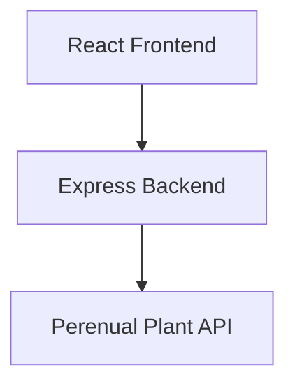
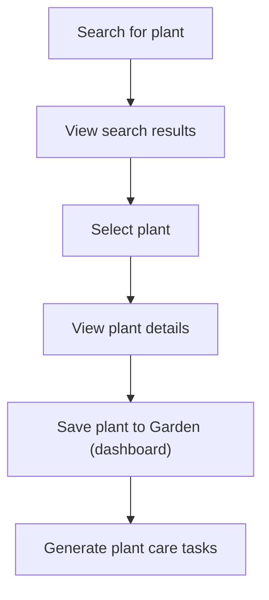
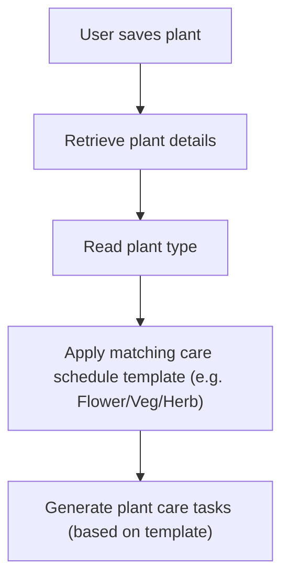

# Perenual API Research & Endpoint Testing

## Overview

The [Perenual](https://perenual.com/) API will be used to provide plant information for the Garden Buddy app.

For the MVP, we need: *plant search*, *plant details*, *plant images*, and *plant categorisation* (for care schedule templates).

The Perenual API provides endpoints for:

- Searching plants (GET `/v2/species-list`) - we will use this endpoint for the Search page and Search results
- Retrieving detailed information about a specific plant (GET `/v2/species/details/{id}`) - we will use this endpoint for the Plant details page

This document contains:

- Research findings
- Endpoint testing results
- Data quality observations and API limitations
- Proposed Garden Buddy Backend endpoints
- Notes on integrating scheduling and task generation


## Application architecture

All API requests should be routed through our Garden Buddy Express backend.



### API Key security

- Store API key in Backend `.env` file
- Don’t share the API key in GitHub
- Frontend should not access the API key directly
- Garden Buddy Express Backend handles all Perenual requests

See [Appendix A](#appendix-a---api-setup) for API setup.


## User journey / workflow

The API should support the following user journey:




## Endpoint 1: Plant Search

Used to search for plants and display search results.

See [Appendix B](#appendix-b---tested-plant-search-terms) for a list of tested plant search terms and their results.

### Perenual endpoint

GET `https://perenual.com/api/v2/species-list?key={API_KEY}&q={PLANT_NAME}`

### Proposed Garden Buddy backend endpoint

GET `/api/plants/search?q={plantName}`

### Endpoint request flow


### Proposed MVP fields

| Field                  | Purpose                       |
|------------------------|-------------------------------|
| `id`                   | Unique plant identifier       |
| `common_name`          | Display name                  |
| `scientific_name`      | Optional, scientific name     |
| `other_name`           | Optional, alternative name    |
| `default_image`        | Plant image                   |


### Search findings

#### Data availability

Testing showed reliable results for most herbs, vegetables, flowers, fruits, and other plants.

#### Regional naming differences

Testing identified differences between UK and US plant names. The API appears to favour US terminology.

*Examples:*

| UK                          | US                            |
|-----------------------------|-------------------------------|
| `beetroot` (no results)     | `beet` (results returned)     |
| `courgette` (no results)    | `zucchini` (results returned) |

*Potential future enhancement:* We could map common UK plant names to recognised API search terms.

#### Duplicate common names

Some search results return multiple plants sharing the same common name, e.g. `carnation`. Observations include:

- Multiple results returned with the same common name
- Scientific names differed between results
- Some records contained additional fields not present in others
- e.g. Some duplicate records contained a `type` field while others did not

*Recommendation:* We may need to display scientific names alongside common names where possible, to help users distinguish between similar plants.

#### Alternative name(s) field

The `other_name` field is not consistently available.

- Some plants contain alternative names
- Alternative names appear to represent regional or common naming variations
- Many tested plants do not include this field

#### Search matching behaviour

Search results do not always contain the search term in the `common_name`, so the API search behaviour appears to be broader than a simple `common_name` lookup.

Results may be matched using `common_name`, `scientific_name`, or `other_name`.


## Endpoint 2: Plant Details

Retrieve and display detailed information about a selected plant.

This information will be used by the Search results and Plant details pages.

See [Appendix C](#appendix-c---tested-plant-details-ids) for a list of tested plant IDs and their results.


### Perenual endpoint

GET `https://perenual.com/api/v2/species/details/{id}?key={API_KEY}`

*Example request:* GET `https://perenual.com/api/v2/species/details/2320?key={API_KEY}` (where `2320` = Plant ID returned from the Search endpoint)

### Proposed Garden Buddy Backend endpoint

GET `/api/plants/{id}`

### Endpoint request flow


### Available fields (examples identified during testing)

- `id`
- `common_name`
- `scientific_name`
- `type` (“vegetable”)
- `origin` (country)
- `cycle` (plant lifecycle, e.g. annual)
- `propagation` (e.g. “Seed Propagation”, “Cutting”, etc)
- `watering` (e.g. “Average”)
- `watering_general_benchmark` (e.g. "3-4 days")
- `sunlight` (e.g. “full sun”)
- `pruning_month`
- `seeds` (true/false)
- `maintenance` (effort required or time/task frquency, e.g. “Low”)
- `care_guides` (e.g. "http://perenual.com/api/species-care-guide-list?species_id=2320&key={API_KEY}")
- `growth_rate` (e.g. “High”)
- `indoor` (true/false)
- `care_level` (how forgiving the plant is, e.g. “Medium”)
- `harvest_season`
- `description` (in long paragraph format)
- `default_image` (same as plant search fields)

### Proposed MVP fields

| Field                        | Purpose                                         |
|------------------------------|-------------------------------------------------|
| `common_name`                | Display name                                    |
| `scientific_name`            | Optional, scientific name (nice to have)        |
| `other_name`                 | Optional, alternative name                      |
| `default_image`              | Plant image (essential for UI)                  |
| `type`                       | Plant type/category, e.g. Herb                  |
|                              | (needed for care schedule template)             |
| `watering`                   | General watering requirements, e.g. "Average"   |
|                              | (useful plant care info)                        |
| `sunlight`                   | General sunlight growing requirements, e.g.     |
|                              | "Full sun" (useful plant care info)             |
| `maintenance`/`care_level`   | Care difficulty (`maintenance` = effort/task    |
|                              | frequency requirements; `care_level` = how      |
|                              | forgiving the plant is)                         |
| `description`                | Detailed plant information (adds value to the   |
|                              | Details page)                                   |


### Plant Details findings

#### Data availability

Most required MVP fields were available for tested plants.

#### Missing/inconsistent data and optional fields

Some fields are not consistently populated across all plants:

- `other_name`
- `type`
- `care_level`
- `default_image`

*Recommendation:* The Frontend will need to handle missing values and display fallback values where appropriate, e.g. 'Information unavailable'.

#### Category (`type`) inconsistencies

Testing found some inconsistencies between `type` values, e.g. "Herb"/"Herbs"/"Bulb" (where plant is also a herb).

Also note that `type` is a string, so cannot store more than one category value (e.g. if a plant could be categorised as more than one type).

*Recommendation:* We may need to try and map these values into simplified internal Garden Buddy categories - such as Herb, Vegetable, Flower - to help support scheduling and task generation logic.

#### API (free-tier) limitations

The API contains thousands of plant species details.

- The free-tier Plant Details endpoint is limited to IDs 1-3000, so this restricts the plants that we can get full details for
- During testing, Plant Details requests succeed for tested IDs <=3000.
- Plant ID 3001 returned an "Upgrade plan" message instead of JSON (JSON parsing error)
- This means that search results may return IDs that cannot be queried successfully for full plant details
- Backend validation and error handling will be required to handle IDs >3000.


### Scheduling integration

The Plant Details endpoint provides a `type` field (see above).

#### Example

```
{
    "type": "Vegetable"
}
```

This provides the connection between Plant management and Scheduling.

#### Proposed workflow



#### MVP Scheduling approach

We will create and use predefined, simplified plant care templates:

- Herb
- Flower
- Vegetable
- General Plant (fallback)

rather than generating schedules directly from API data.

For the detailed scheduling workflow, care templates, task generation logic, and recurring task behaviour, see [MVP Scheduling & Task Generation Design](scheduling-task-generation-design.md).

**Potential future enhancement:** 

The API appears to provide broad watering categories such as "Average", as well as a `watering_general_benchmark` field, e.g.

```
"watering_general_benchmark": {
    "value": "\"3-4\"",
    "unit": "days"
}
```

This field could potentially be used to generate more accurate, plant-specific watering schedules, instead of the generic template-based watering task frequency used in the MVP.


## Optional Endpoint 3: Species Care Guide

This endpoint could be used for potential future enhancement/stretch goal.

See [Appendix D](#appendix-d---optional-endpoint-3-species-care-guide) for details.


## Proposed MVP data fields / UI usage

### Search Results

- `id`
- `common_name`
- `scientific_name`
- `default_image`

### Plant Details

- `id`
- `common_name`
- `scientific_name`
- `type`
- `watering`
- `sunlight`
- `maintenance`/`care_level`
- `description`
- `default_image`

### Saved Plants

Recommended fields to store in Firebase when a plant is added to the User's garden:

- `user_id`
- `plant_api_id`
- `common_name`
- `scientific_name`
- `plant_type`
- `plant_image`
- `date_added`


## Notes & Limitations

### API rate limits

Free tier allows developer accounts to make 100 API requests per day.

We could store saved plant data from Perenual (or part of it) into Firebase when User clicks `Add Plant to Garden`. This will reduce repeated API requests for the same plant, and helps avoid free-tier rate limits during development and testing.

### Pagination

Search results are paginated (e.g. `page={page_number}`)

We could ignore pagination for MVP and use the first page of results only.


## Conclusion

Overall, the Perenual Search and Plant Details endpoints provide all of the information required for the Garden Buddy MVP. The API supports plants search, plant details, plant images, and plant categorisation.

The plant `type` (categorisation) field provides the connection between plant management and plant care scheduling, by enabling the app to select the appropriate (e.g. Flower/Veg/Herb) schedule template.

Testing identified some data quality and consistency considerations, including:

- Missing optional fields
- Duplicate common names
- Category inconsistencies
- Regional naming differences
- Free-tier Plant Details restriction

These findings need to be considered when designing and implementing the Garden Buddy Plant API, Firebase storage, scheduling logic, and Frontend user experience.

### Recommended approach for MVP

- Use Perenual Search for plant discovery
- Use Perenual Plant Details for plant information
- Map Perenual categories into simplified Garden Buddy categories
- Use predefined care templates for scheduling
- Focus initially on plants with verified Plant Details endpoint results


## APPENDICES

### Appendix A - API Setup

#### Documentation

https://perenual.com/docs/api 

#### Generate an API key

Perenual API requires an API key (e.g. GET `https://perenual.com/api/v2/species-list?key={API_KEY}`). 

Log in and click on ‘Get API Key & Access’.

---

### Appendix B - Tested plant search terms

| Search term          | Result           | Example id        |
|----------------------|------------------|-------------------|
| basil	               | Success          | 5498              |
| cilantro             | Success          | 2098              |
| tarragon             | Success          | 974               |
| dill                 | Success          | 834               |
| celery               | Success          | 862               |
| fennel               | Success          | 2979              |
| rosemary             | Success          | 7109              |
| calamint             | Success          | 1464              |
| carrot               | Success          | 2320              |
| tomato               | Success          | 5021              | 
| turnip               | Success          | 1333              |
| kale                 | Success          | 1320              |
| beetroot             | No results       |                   |
| beet                 | Success          | 1273              |
| courgette            | No results       |                   |
| zucchini             | Success          | 2255              |
| brussel sprouts      | Success          | 1325              |
| broccoli             | Success          | 1327              |
| asparagus            | Success          | 1026/1027/1029    |
| chives               | Success          | 669               |
| pineapple            | Success          | 791               |
| strawberry           | Success          | 3013              |
| apple                | Success          | 362/363/365       |
| dahlia               | Success          | 2300              |
| daisy                | Success          | 1227              |
| carnation            | Success          | 2380              |
| daffodil             | Success          | 5325              |
| foxglove             | Success          | 2483/2493         |
| qwerty123            | No results       |                   |


#### Example empty response

```
{
    "data": [],
    "total": 0
}
```

#### Example response

```
{
"id": 123,
"common_name": "Plant Name, e.g. carrot",
"scientific_name": "Scientific Name",
"other_name": [],
"default_image": {
    "original_url": "..."
    }
}
```

---

### Appendix C - Tested plant details (IDs)

| ID        | Plant name      | Results/data notes                                       |
|-----------|-----------------|----------------------------------------------------------|
| 5498 	    | basil           | Returns: `SyntaxError: Unexpected token 'P',`            |
|           |                 | `"Please Upg"... is not valid JSON`                      |
|           |                 | `at JSON.parse (<anonymous>)`                            |
| 2098      | cilantro        | Herb, no `care_level`                                    |
| 974       | tarragon        | Herb                                                     |
| 834       | dill            | Herb, no `other_name`, no `care_level`                   |
| 862       | celery          | Herb, no `other_name`                                    |
| 2979      | fennel          | Herb, no `other_name`                                    |
| 7109      | rosemary        | Returns: `SyntaxError: Unexpected token 'P',`            |
|           |                 | `"Please Upg"... is not valid JSON`                      |
|           |                 | `at JSON.parse (<anonymous>)`                            |
| 1464      | calamint        | Herbs, no `other_name`                                   |
| 2320      | carrot          | Vegetable, no `other_name`                               |
| 5021      | tomato          | Returns: `SyntaxError: Unexpected token 'P',` (as above) | 
| 1333      | turnip          | Vegetable, no `other_name`                               |
| 1320      | kale            | Vegetable, no `other_name`                               | 
| 1273      | beet            | Vegetable, no `other_name`                               |
| 2255      | zucchini        | Fruit, matches with `other_name` only                    |
| 1325      | brussel sprouts | Vegetable, no `other_name`                               |
| 1327      | broccoli        | Vegetable, no `other_name`                               |
| 1026      | asparagus       | `type` null, 1027 duplicate is Vegetable, no `other_name`|
| 669       | chives          | Bulb (but is also a herb), no `other_name`               |
| 791       | pineapple       | Fruit, no `other_name`                                   |
| 3013      | strawberry      | Returns: `SyntaxError: Unexpected token 'P',` (as above) |
| 362       | Gala apple      | tree, various apple types e.g 363/365, no `other_name`,  |
|           |                 | no `maintenance` or `care_level`                         |
| 2300      | dahlia          | Flower, no `other_name`                                  |
| 1227      | English daisy   | Flower                                                   |
| 2380      | carnation       | Flower, no `other_name` or `care_level`                  |
| 5325      | daffodil        | Returns: `SyntaxError: Unexpected token 'P',` (as above) |
| 2483      | foxglove        | Herb (incorrect, should be Flower), no `other_name`,     |
|           |                 | `default_image` null                                     |
| 2493      | common foxglove | `type` null, no `other_name`, `care_level` null,         |
|           |                 | `default_image` null                                     |


#### Example JSON response

```
{
"id": 2320,
"common_name": "Plant Name, e.g. carrot",
“scientific_name”: “Scientific Name”,
“type”: “Vegetable”,
"cycle": "Annual",
"watering": "Average",
"watering_general_benchmark": {
    "value": "\"3-4\"",
    "unit": "days"
},
"sunlight": ["Full Sun"],
"default_image": {
    "original_url": "..."
    }
}
```

---

### Appendix D - Optional Endpoint 3: Species Care Guide

Provides detailed (pruning, watering, and sunlight) care instructions for a selected plant, in long paragraph format.

Potential stretch goal - not required for MVP.

Info available:

- Watering guidance
- Sunlight guidance
- Pruning guidance

These could be used in future for more detailed plant info and more accurate/improved plant care schedule generation – particularly watering and pruning guidance.

Example request:

GET `https://perenual.com/api/species-care-guide-list?key={API_KEY}&q={plant_type}`

(where plant_type e.g. Vegetable)

The endpoint also supports:

- q={plant_name} (for searching guides by name) - e.g. `https://perenual.com/api/species-care-guide-list?key={API_KEY}&q=carrot`
- type=watering,sunlight (to limit guide sections)
- page={page_number} (for pagination)