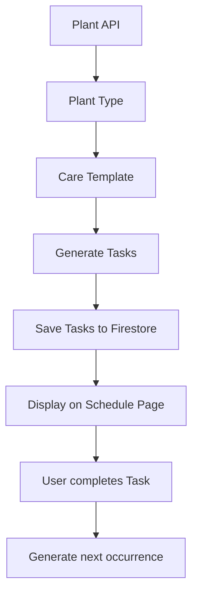
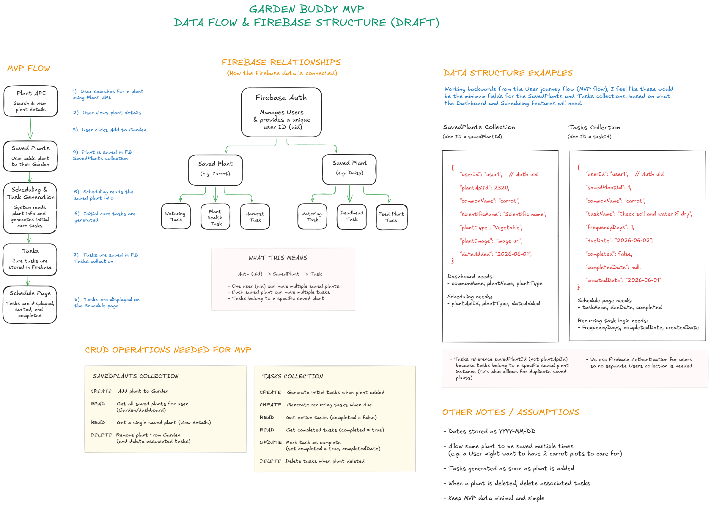
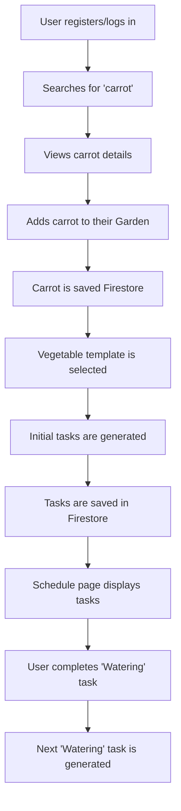
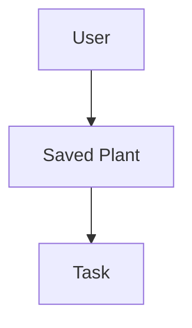

# MVP Scheduling & Task Generation Design

## Overview

The aim of this feature is to help users look after their plants by automatically creating simple care tasks when a plant is added to their Garden.

For the MVP, Garden Buddy uses a small set of our own simplified plant care templates, rather than creating plant-specific schedules for every plant.

These templates cover three broad plant categories (`plantType`):

- Herbs
- Flowers
- Vegetables

Plants that do not fall into one of these categories will be assigned a General Plant template, so that all saved plants can receive a basic care schedule.


## Table of Contents

- [Workflow](#workflow)
- [MVP Data Flow and Firestore Structure](#mvp-data-flow-and-firestore-structure)
- [Plant Care Schedule Templates](#plant-care-schedule-templates)
    - [Herb template](#herb-template)
    - [Flower template](#flower-template)
    - [Vegetable template](#vegetable-template)
    - [General Plant template](#general-plant-fallback-template)
- [Schedule and Task Generation Workflow](#schedule--task-generation-workflow)
- [Recurring Task Logic](#recurring-task-logic)
- [Example User Journey](#example-user-journey)
- [Relationship to Other Project Areas](#relationship-to-other-project-areas)
- [Example Firestore Collections and Relationships](#example-firestore-collections-and-relationships)


## Workflow

When a user adds a plant to their Garden:

1. The plant is saved to Firestore
2. The plant `plantType` is used to select a care template
3. Initial care tasks are generated, with due dates calculated from the date plant was added to Garden
4. Tasks are saved to Firestore
5. Tasks are displayed on the Care Schedule page
6. Recurring tasks generate their next occurrence when marked as completed



If a user removes a plant from their Garden, all tasks associated with that saved plant are also removed. This prevents un-linked tasks from remaining in the schedule after the plant has been deleted.


## MVP data flow and Firestore structure

The following diagram illustrates the overall MVP workflow, Firestore collections, data relationships, and scheduling task generation process.



See also [Example Firestore Collections and Relationships](#example-firestore-collections-and-relationships) section below.


## Plant Care Schedule Templates

Templates are loosely based on real gardening principles, while remaining simple and understandable for novice gardeners.

### Herb template

**Care level/frequency:** Low

Herbs are generally grown for their leaves. They are relatively forgiving, and don't need much attention besides regular harvesting.

| Task                         | Frequency       |
| ---------------------------- | --------------- |
| Check soil and water if dry  | (every 3 days)  |
| Check plant health and pests | (every 7 days)  |
| Harvest or trim leaves       | (every 14 days) |

#### Example

`tarragon` added on `01/06/2026`

- [ ] Check soil and water if dry - 4 Jun
- [ ] Check plant health and pests - 8 Jun
- [ ] Harvest or trim leaves - 15 Jun

### Flower template

**Care level/frequency:** Medium

Flowers are maintained for appearance and blooms, so removing dead flowers ('deadheading') is a key recurring task.

| Task                        | Frequency       |
| --------------------------- | --------------- |
| Check soil and water if dry | (every 2 days)  |
| Remove dead flowers         | (every 7 days)  |
| Feed plant                  | (every 14 days) |

#### Example

`dahlia` added on `01/06/2026`

- [ ] Check soil and water if dry - 3 Jun
- [ ] Remove dead flowers - 8 Jun
- [ ] Feed plant - 15 Jun

### Vegetable template

**Care level/frequency:** High

Vegetables need the most frequent attention, including regular watering, health (pest) checks, and harvesting. Because of wide variety in harvesting frequency between different vegetables, a weekly task prompts users to check their plants regularly and harvest if ready.

| Task                          | Frequency      |
| ----------------------------- | -------------- |
| Check soil and water if dry   | (every 1 day)  |
| Check plant health and pests  | (every 5 days) |
| Harvest ripe produce if ready | (every 7 days) |

#### Example

`carrot` added on `01/06/2026`

- [ ] Check soil and water if dry - 2 Jun
- [ ] Check plant health and pests - 6 Jun
- [ ] Harvest ripe produce if ready - 8 Jun

### General Plant (fallback) template

**Care level/frequency:** Low/Medium

All other plants (including those with `type`: `null`) will be categorised as 'General Plant' and assigned this template, so that all saved plants receive a basic care schedule. It is designed to be broadly applicable to most plants.

| Task                                           | Frequency       |
| ---------------------------------------------- | --------------- |
| Check soil and water if dry                    | (every 4 days)  |
| Check plant health and pests                   | (every 7 days)  |
| Check plant growth and prune/harvest if needed | (every 14 days) |


## Schedule & task generation workflow

### 1. User adds plant

**Example:** `carrot`

The selected plant is saved to the SavedPlants collection.

```
{
    "userId": "user1",
    "plantApiId": 2320,
    "commonName": "Carrot",
    "plantType": "Vegetable",
    "dateAdded": "2026-06-01"
}
```

### 2. Select template

Garden Buddy reads the `plantType` field from the saved plant, and selects the appropriate care template (e.g. `Vegetable`).

### 3. Generate initial tasks

**Example:** `carrot` added on `01/06/2026`

**Due dates:**

Check soil and water if dry
`01/06/2026` + 1 days = `02/06/2026`

Check plant health and pests
`01/06/2026` + 5 days = `06/06/2026`

Harvest ripe produce if ready
`01/06/2026` + 7 days = `08/06/2026`

**Generated tasks:**

```
[
    {
        "taskName": "Check soil and water if dry",
        "frequencyDays": 1,
        "dueDate": "2026-06-02",
        "completed": false
    },
    {
        "taskName": "Check plant health and pests",
        "frequencyDays": 5,
        "dueDate": "2026-06-06",
        "completed": false
    },
    {
        "taskName": "Harvest ripe produce if ready",
        "frequencyDays": 7,
        "dueDate": "2026-06-08",
        "completed": false
    },
]
```

### 4. Save tasks

Tasks are stored in Firestore.

**Example:**

```
{
    "userId": "user1",
    "savedPlantId": "savedPlant1",
    "commonName": "carrot",
    "taskName": "Check soil and water if dry",
    "frequencyDays": 1,
    "dueDate": "2026-06-02",
    "completed": false,
    "completedDate": null,
    "createdDate": "2026-06-01"
}
```


## Recurring task logic

Tasks automatically generate a new recurring task when completed.

**Example workflow:**

Garden Buddy:

1. Marks existing task as completed
2. Records the task completion date
3. Calculates next due date, using the completion date and task frequency
4. Generates next recurring task with updated due date

**Completed tasks:**

Completed tasks remain stored in Firestore.

To allow users to track their progress (task history), completed tasks may remain visible in a separate history/completed tasks section (above or below an 'current/active tasks' section).

To stop the Schedule page getting too cluttered, only recent completed tasks should be displayed (e.g. tasks completed within the previous two weeks, or the most recent five completed tasks).

For recurring tasks, the next due date is calculated from the date the previous task was completed, rather than the original due date.

**Example logic:**

Once task is marked completed:

```
{
    "taskName": "Check soil and water if dry",
    "completed": true,
    "completedDate": "2026-06-02",

}
```

the next recurring task is generated:

```
{
    "taskName": "Check soil and water if dry",
    "completed": false,
    "dueDate": "2026-06-03"
}
```


## Example user journey




## Relationship to other project areas

### Plant API

Plant API provides plant information, including the plant type used when a plant is saved to the user's Garden.

The scheduling system reads the saved plant's `plantType` field, and uses it to apply the appropriate care schedule template.

For details of the Perenual API research, endpoint testing, available fields, and data considerations, see [Perenual API Research & Endpoint Testing](perenual-api-research.md).

### Firebase

Firebase Authentication manages user accounts and provides a unique user ID (`uid`) for each user.

Firestore stores Saved Plants and generated Tasks, and completed tasks. Each record contains the user's Firebase uid (`userId`), so that plants and tasks can be linked to the correct user.

### Frontend

The Frontend displays plant information, generated tasks, and task completion status.


## Example Firestore Collections and relationships

The MVP scheduling system uses Firebase Authentication for user accounts, and Firestore collections for Saved Plants and Tasks.

Each Saved Plant and Task stores the authenticated user's Firebase uid (`userId`) to ensure that records belong to the correct user.

We will use the following Firestore collections:

### SavedPlants

Stores plant(s) added to a user's Garden (Dashboard).

**Example:**

```
{
    "userId": "user1",
    "plantApiId": 2320,
    "commonName": "carrot",
    "scientificName": "Scientific name",
    "plantType": "Vegetable",
    "imageURL": "image-url",
    "dateAdded": "2026-06-01"
}
```

### Tasks

Stores generated care tasks (based on the pre-defined plant care schedules).

**Example:**

```
{
    "userId": "user1",
    "savedPlantId": "savedPlant1",
    "commonName": "carrot",
    "taskName": "Check soil and water if dry",
    "frequencyDays": 1,
    "dueDate": "2026-06-02",
    "completed": false,
    "completedDate": null,
    "createdDate": "2026-06-01"
}
```

### Data relationships

The scheduling system uses three main types of data that are linked together.



A user can save multiple plants to their Garden, and each saved plant can have multiple generated care tasks.

These records are lnked using Firebase Authentication and Firestore document IDs.

- A user is identified by their Firebase Authentication uid.
- A user can save multiple plants.
- Each saved plant is stored in a separate Firestore document.
- Each saved plant can have multiple generated tasks.
- Tasks reference the Firestore savedPlantId, so they can be linked back to the plant that generated them.
